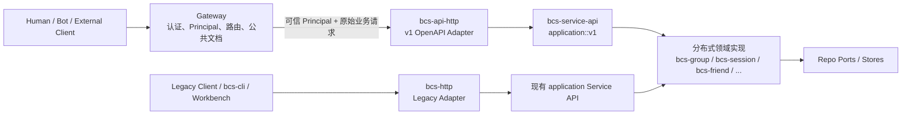
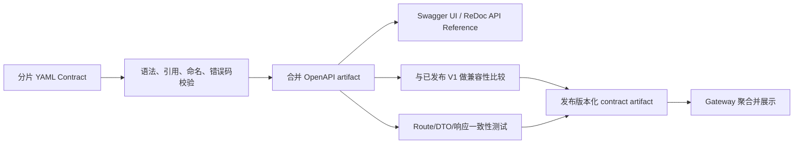

# BCN OpenAPI V1 架构与接口设计

> **Path exposure update (2026-08-03):** Resource semantics in this document
> remain historical design context, but its path examples are superseded by
> [`2026-08-03-bcn-collaboration-prefix-design.md`](./2026-08-03-bcn-collaboration-prefix-design.md).
> Every current BCN V1 endpoint is exposed below
> `/openapi/v1/collaboration/**`.

> 状态：Draft for review
>
> 日期：2026-07-28
>
> 范围：`src/bcs`、`src/gateway`
>
> 文档类型：架构与接口设计文档（High-Level Design）

## 1. 文档定位

本文记录 BCN 第一阶段 OpenAPI 改造的目标、边界、关键架构决策、API
范围、身份与授权模型、crate 组织、契约治理和演进方式。

本文不是最终的 OpenAPI Contract，也不是逐文件的实施计划：

- 本文回答“为什么这样设计、组件边界是什么、第一阶段做什么”。
- 仓库中的 OpenAPI YAML 回答“每个接口准确接受和返回什么”，是接口契约的唯一事实来源。
- 后续实施计划回答“按什么顺序修改哪些文件、运行哪些测试”。

设计遵循 `docs/arch/arch.rules.md`：契约先行、核心逻辑与传输解耦、Delivery
Adapter 不承载领域策略、依赖只指向声明的 Service API。

## 2. 背景与问题

BCN 当前在 `bcs-http` 中维护一套长期演进的 Legacy HTTP API。生产链路、
Workbench、`bcs-cli` 和 E2E 脚本仍然使用这些接口。Legacy API 同时包含身份
提取、HTTP DTO、兼容逻辑和历史语义，例如部分 Group 消息接口允许 Human
指定自己拥有的 Bot 作为 sender。

新的平台调用链在 BCN 上游增加统一 Gateway：

1. 外部调用者只访问 Gateway。
2. Gateway 认证原始凭证并形成规范化 Principal。
3. Gateway 将可信 Principal 传给 BCN。
4. BCN 不再解析外部用户的 Cookie、Token 或 AgentPass，而是根据 Principal
   和 BCN 自己拥有的资源关系执行授权。

改造必须同时解决：

- 新增稳定、可版本化的 OpenAPI 和 Internal API 边界。
- 保持全部 Legacy 生产接口继续工作。
- 通过稳定的 Bot 协作子资源前缀区分 TeamClaw 与 BCN 的 `/bots` 路由所有权。
- 把身份认证与资源授权分开。
- 让 HTTP Adapter、Application Service 和领域实现保持正确依赖方向。
- 从权威 Contract 自动生成文档并自动阻止不兼容修改。

## 3. 目标与非目标

### 3.1 第一阶段目标

- 新增 `/openapi/v1/**` 公共 API，不修改 Legacy 路由及语义。
- OpenAPI 和 Internal API 都经由 Gateway。
- Gateway 建立规范化 Principal，BCN 执行资源级授权。
- 第一阶段覆盖 Group、Session、Participant、Invitation 和 Friendship。
- 为新接口建立独立的 HTTP Adapter 和版本化 Application Service API。
- 以 OpenAPI YAML 为接口事实来源，生成合并文档和可浏览的 API Reference。
- 建立契约校验、实现一致性测试和向后兼容检查。

### 3.2 第一阶段非目标

- 不下线或收紧 `POST /groups/{id}/messages`、`POST /groups/{id}/chat`
  等 Legacy 接口。
- 不为 Legacy API 接入新的权限模型。
- 不提供 Group 级消息发送接口。
- 不提供 `POST /openapi/v1/collaboration/sessions/{session_id}/messages`。
- 不设计 SSE；现有 WebSocket 和 callback 也不属于本次改造。
- 不包含 Bot Registration、Bot Profile、Provider、Service Invocation、
  CollaborationTemplate、StateMachineRun、Session File 和 collect。
- 不引入 ServiceKey、ProviderPrincipal 或 Gateway 自身发起请求的
  InternalService Principal。
- 不在本阶段确定 Gateway 与 BCN 之间 Principal 签名、密钥轮换和验签的最终实现。

## 4. 核心架构



新旧 HTTP Adapter 共享领域能力和存储，但不共享 HTTP DTO、路由和兼容逻辑。
这使新接口可以建立更严格的身份、授权和错误契约，而不会改变生产中的 Legacy
行为。

### 4.1 组件职责

| 组件 | 职责 |
| --- | --- |
| Gateway | 校验外部凭证，形成 Principal，执行入口级策略，按资源域路由，聚合公共 OpenAPI 文档 |
| `bcs-api-http` | 新 V1 HTTP 路由、DTO、Principal 提取接口、协议校验、Envelope 和错误映射 |
| `bcs-http` | 只维护现有 Legacy HTTP 行为 |
| `bcs-service-api::application::v1` | 新 V1 Use Case 契约，不依赖 Axum 或 HTTP 类型 |
| 领域 service crates | 实现授权后的业务规则和 Use Case orchestration |
| store crates | 实现 Repo Port、持久化和查询 |
| bootstrap | 注入具体实现，同时挂载 Legacy 与 V1 Router |

## 5. 路径与资源所有权

### 5.1 公共与内部路径

| API 类型 | 路径 | 说明 |
| --- | --- | --- |
| OpenAPI | `/openapi/v1/**` | 面向产品、Bot 和外部集成；路径不包含 `bcn` |
| Internal API | `/internal/v1/**` | 面向受信任内部服务和运维工具；路径同样不包含 `bcn` |
| Legacy API | 现有路径 | 不改名、不迁移、不改变语义 |

HTTP 路径统一采用 `/{api_type}/v1/**`。代码中的 OpenAPI 和 Internal API
共享同一版本生命周期，因此模块目录采用 `v1/openapi` 和 `v1/internal`。

### 5.2 Gateway 路由

Gateway 按 `/openapi/v1` 后的最长稳定资源前缀选择上游。第一阶段只需按资源域
或固定子资源前缀配置，不需要为每个 operation 配置 `contract_owner`：

| 资源前缀 | 上游 |
| --- | --- |
| `collaboration/**` | BCN |
| 其他非协同资源前缀 | Gateway 对应 owner |

BCN 不拥有通用 Bot 资源，也不引入 `Actor` 公共抽象。Gateway 将
`/openapi/v1/collaboration/**` 作为 BCN 的唯一公共 ownership prefix 转发；其他
Bot、Session 或 Backend/BaaS 资源路径仍由各自 owner 维护。公共 Contract、
Application Command 和 BCN 领域关系在 Bot 标识字段上统一使用 `bot_uuid` 或
路径参数语义明确的 `bot_id`。

Gateway 首次接入 BCN 时需要增加上述资源前缀到同一个 BCN upstream 的映射；
后续同一前缀下新增兼容 operation 不需要逐接口改 Gateway。

## 6. Principal 与信任边界

### 6.1 当前事实

Gateway 当前实现了 `UserPrincipal`：

- `type = user`
- `tenant`
- `scopes`
- `subject: AuthenticatedUser`

`AuthenticatedUser` 是认证插件返回的中立用户对象，当前包含稳定用户 ID、用户名
以及可选展示名称、全名和租户信息。它不是 BCN 的 Bot 资源。

当前 Gateway 尚未实现 BotPrincipal。Gateway 的认证设计已经提出“签名的短期
Principal Token”方向，但 Gateway 到 BCN 的签发、转发和验签尚未完成接入。

### 6.2 BCN 目标接口

BCN 新 API 只接受投影后的领域 Principal：

```text
Principal
├── Human { authenticated_user, tenant, scopes }
│           └── BCN application projection: human_<subject.id>
└── Bot   { actor_id = bot_uuid, bot_uuid, tenant, scopes }
```

约束如下：

- Gateway BotPrincipal 中的 Bot UUID 必须与 BCN `bot_uuid` 属于同一全局唯一的
  标识空间，不能因租户不同而复用同一个 Bot UUID。
- Human Principal 不携带 BCN `actor_id`。BCN Application 根据权威
  `subject.id` 投影为现有 `human_<subject.id>`，供 Participant、Relation 和
  Group role 授权使用。该内部 Actor ID 不能当作 `bot_uuid` 使用，也不代表
  Human 可以作为其管理的 Bot 发言。
- `tenant` 是 Principal 的身份元数据，不是 BCN 协作隔离边界。Group 不绑定
  tenant，也不要求 caller、driver 或 Participant 属于同一 tenant。跨租户 Bot
  的发现、DM、群聊和建群协作与同租户行为一致，统一由 Bot visibility、
  Friendship/Relation、Group Participant 和 role 规则授权。Human Actor ID
  和 `created_by` 均不拼接 tenant；相同 `subject.id` 按同一个自然人处理。
- Human Principal 参与 Bot 资源关系管理时，请求中的 `bot_uuid` 必须由 BCN
  根据权威 `created_by = subject.id` 关系授权。
- V1 Human 创建 DM 时，BCN 继续调用现有 `ensure_human_actor`，展示名称沿用
  `display_name -> full_name -> username`，并把内部
  `human_<subject.id>` 交给现有 Group Management 流程。
- BCN 不接触外部原始 Cookie、Bearer Token 或 AgentPass。
- ProviderPrincipal、ServiceKey 和 InternalService 不在第一阶段 union 中。

Gateway `UserPrincipal.subject.id` 与 BCN Bot `created_by` 采用同一稳定身份
空间。BCN 不使用 `username`、展示名称或 tenant 构造 ownership identity；
`human_` 只由 BCN Application 统一添加，不能由各个 Route 自行拼接。

### 6.3 Principal 如何进入 BCN

V1 HTTP Adapter 定义抽象的 Principal 获取接口。Route 只从请求扩展中读取已经
验证的 Principal：

```text
Gateway principal token
        │
        ▼
PrincipalVerifier / extractor
        │  验签、aud/iss/exp 校验、反序列化
        ▼
BCN Principal
```

本地开发和单元测试可以注入静态 Principal；生产环境不能信任裸
`X-Avernet-Principal` JSON Header。最终机制需满足：

- 请求确实来自合法 Gateway。
- Principal 未被篡改。
- Token 绑定 BCN audience。
- Token 有短 TTL，并支持密钥轮换。
- 失败时 fail closed，返回统一 `401`，不回退到 Legacy 身份提取。

签名 JWT、mTLS 加签 Header 或其他实现可以后续确认，但不会改变 Route 和
Application Service 使用 Principal 的接口。

## 7. 授权模型

### 7.1 认证与授权分离

- Gateway 回答“调用者是谁、入口凭证是否合法”。
- BCN 回答“该 Principal 是否能对目标 BCN 资源执行该 Action”。

HTTP Route 不直接判断 `created_by`、Participant role 或 Friendship。Route 将
Principal、Action 和资源标识交给 Application 层。授权策略从 BCN 已有领域关系
派生，不维护一套与领域数据重复的细粒度 ACL。

建议的稳定 Action 粒度包括：

```text
GroupRead / GroupCreate / GroupManage
GroupParticipantManage
SessionRead / SessionCreate / SessionManage / SessionComplete
SessionParticipantManage
SessionMessageRead
InvitationCreate / InvitationAccept
FriendshipRead / FriendshipManage
FriendRequestCreate / FriendRequestDecide
```

Action 是 Application 层概念，不暴露 HTTP 状态码。

### 7.2 关键授权原则

- Group 和 Session 的读取、管理权限从 originator、driver、领域管理角色、
  直接 Participant 和 SessionParticipant 关系推导。授权比较规范化
  `actor_id`，不因 Actor 是 Human 或 Bot 而采用不同的 Group 管理规则。
- Group 创建请求可以选择任意对当前 Principal“可协作”的
  `driver_bot_uuid`。Bot 所有权只是可协作关系的一种来源，不要求 Human
  必须管理 driver，也不要求 BotPrincipal 自身必须成为 driver。
- V1 不接受 request-supplied `originator`。Application 在完成 Participant
  校验、补齐 driver 并形成 canonical Participants 后按以下规则推导：

  ```text
  if principal.actor_id in canonical_participants:
      originator_actor_id = principal.actor_id
  else:
      originator_actor_id = driver_bot_uuid
  ```

- `originator_actor_id` 可以是 Human 或 Bot。originator 与 driver 都拥有
  Group 管理权限；增删成员等管理授权只比较 Actor 和角色，不允许 Human
  冒充其管理的 Bot。
- `created_by_principal` 独立记录创建审计信息，不自动授予 Group 管理权限。
  Human 创建 Group 但未加入 canonical Participants 时，Human 不具备
  originator 权限，只有 fallback 后的 driver 具备对应权限。
- Participant 自身可以退出；originator、driver、ManagerWorker manager 等
  持有必需角色或 Group 级管理职责的 Actor 在转移职责前不能被移除。该不变量
  同样不区分 Human 与 Bot；consultant、observer、worker 等普通角色仍可移除。
- Bot 消息的默认响应和 coordinator 路由使用 driver/lead role，不使用
  originator。V1 不依赖 `selector.type=originator`；Legacy WS 协议的兼容和
  废弃另行处理。
- Invitation 创建者必须有目标 Group/Session 的管理权限；Bot 可以为自身接受
  邀请，Human 只能为 `created_by` 关系确认的目标 `bot_uuid` 接受邀请。
- Friendship 仅存在于两个 Bot 之间。Bot 可以管理自身关系；Human 可以
  基于 `created_by` 关系管理其创建 Bot 的 Friendship。
- “Human 可以管理其创建的 Bot”不等于“Human 可以作为该 Bot 发言”。
- 新接口中的 Bot 身份来自 BotPrincipal 或受授权的 `bot_uuid` 资源管理参数，不能通过
  `sender`、`from` 等字段改变调用身份。
- Provider 能否管理目标 Provider/Bot 等资源，留待 ProviderPrincipal 阶段处理。

### 7.3 对 Legacy 的影响

新授权模型只用于 V1 API。第一阶段不修改 Legacy 的身份提取、兼容授权和返回
格式，也不下线 Group 级消息接口。Legacy 下线需要后续独立方案、调用方迁移和
生产流量确认。

## 8. 第一阶段 OpenAPI

第一阶段采用“领域闭环最小集”：覆盖 Bot control plane、Group、Session、
Participant、Invitation、Friendship/FriendRequest 和 session-bound WebSocket
的管理闭环，不机械复制 Legacy Router。当前公开 contract 共 32 个 operation，
全部挂载在 `/openapi/v1/collaboration/**` 下。

### 8.1 Group

| Method | Path | Operation |
| --- | --- | --- |
| GET | `/openapi/v1/collaboration/bots/{bot_id}/groups` | 查询 path Bot 参与的 Group |
| POST | `/openapi/v1/collaboration/groups` | 创建 Group |
| GET | `/openapi/v1/collaboration/groups/{group_id}` | 获取 Group 详情 |
| PATCH | `/openapi/v1/collaboration/groups/{group_id}` | 修改 Group 可变属性 |
| DELETE | `/openapi/v1/collaboration/groups/{group_id}?acting_bot_id=...` | 删除 Group，可选指定 Bot 身份视角 |

`GET /openapi/v1/collaboration/bots/{bot_id}/groups` 使用 path 中的
`bot_id` 作为查询视角，不再接受 `view_bot_id`。保留以下查询参数：

```text
offset
limit
q
membership = all | direct | session_only
kind       = normal | dm | all
strategy   = chat | manager_worker | state_machine
```

`membership` 默认 `all`，`kind` 默认 `normal`，`strategy` 省略时不过滤。
`session_only` 是关系过滤条件，不单独设计成子资源。同一个 Bot 同时具有直接
GroupParticipant 和 SessionParticipant 关系时按 `direct` 返回；过滤、去重必须
发生在分页之前。`kind=dm` 与任意 `strategy` 组合非法并返回 400；
`kind=all` 与 `strategy` 组合时只返回匹配 strategy 的 normal Group，DM 被排除。

创建 Group 时，`driver_bot_uuid` 是请求选择的协作驱动 Bot，只要求对当前
Principal 可协作，不要求所有权。请求不包含 `originator_actor_id`，也不允许
携带 `visibility`；新建 Group 默认均为 `private`。Application 根据规范化
Principal 和 canonical Participants 推导并返回 `originator_actor_id`。originator
可以是 Human 或 Bot，但 Bot 消息的默认响应者始终由 `driver_bot_uuid`/lead role
决定。

Chat Group 创建请求中的 `delivery_policy` 不是必填；省略时默认
`bot_final_delivery=send_to_driver`。结构化协同 Group 创建请求不再传
`definition_id/version`，而是在 `collaboration.definition.content_yaml` 中传入
内联 YAML 内容，由 BCN 在创建时校验和持久化。

DM 创建继续使用 Legacy 已有的 `target_actor_id`，不改名为
`target_bot_uuid`。该字段只属于 `group_kind=dm` 的创建请求；第一阶段要求它
解析到 Bot Actor，但 Actor 命名保留未来扩展空间。`target_actor_id` 不作为独立
列落库：Application 将 caller 和 target 写成两个 GroupParticipant，并将双方
规范化 `actor_id` 按字典序组成 `dm_pair_key=min(a,b) + "|" + max(a,b)`。
`bcs_groups` 保存 `group_kind=dm`、`dm_pair_key`、`driver_bot` 和 `originator`，
`bcs_group_participants` 保存双方 `actor_id`（沿用历史列名 `bot_uuid`）及
`actor_kind`。`(env, dm_pair_key)` 唯一约束保证同一对 Actor 复用同一个 DM
Group，因此数据库不保存有方向的“target”关系。

V1 不暴露 Legacy `RoutingPolicy` 的 `mode` 和 `sender_routes`。新 Contract
使用收窄后的投递模型：

```yaml
delivery_policy:
  type: object
  additionalProperties: false
  required:
    - bot_final_delivery
  properties:
    bot_final_delivery:
      type: string
      enum:
        - send_to_driver
        - inject_observers
```

`delivery_policy` 只表达 Bot 最终输出如何投递，不再称为完整的
`routing_policy`。V1 创建 Group 时，Application 将
`delivery_policy.bot_final_delivery` 映射到 Legacy
`RoutingPolicy.default_bot_final_delivery`，内部 `mode` 固定为 `hybrid`，
`sender_routes` 固定为空。V1 查询只投影 `bot_final_delivery`；V1 PATCH
只修改 `default_bot_final_delivery`，必须保留存量 Group 的 `mode` 和
`sender_routes`，不能因 V1 未暴露而清空。Legacy API、共享领域对象、消息路由
和数据库继续保留完整 `RoutingPolicy`，其下线或数据清理不属于第一阶段。

#### 8.1.1 列表投影：GroupSummary

列表接口返回轻量 `GroupSummary`，不返回完整 `GroupDetail`。`GroupSummary`
以 `kind` 为 discriminator：

```text
GroupSummary
├── NormalGroupSummary          kind=normal
└── DirectMessageGroupSummary   kind=dm
```

公共字段为：

```text
group_id
version
name
kind
status
visibility
membership = direct | session_only
originator_actor_id
participant_count
created_at
updated_at
```

`membership` 是路径中 `bot_id` 与 Group 的关系，不是 Group 聚合的固有属性。
NormalGroupSummary 额外返回 `driver_bot_uuid` 和
`strategy=chat|manager_worker|state_machine`。DirectMessageGroupSummary
不返回 strategy、driver 或 delivery policy，而是返回相对于路径
`bot_id` 的 `peer_actor`。列表不内嵌完整 Participants、StateMachine
definition/bindings、delivery policy 或运行状态。

#### 8.1.2 详情投影：GroupDetail

`GET /openapi/v1/collaboration/groups/{group_id}` 返回完整 `GroupDetail`，不复用
`GroupSummary`。详情采用两层 discriminated union：

```text
GroupDetail
├── CollaborationGroupDetail   kind=normal
│   └── collaboration
│       ├── ChatConfiguration          strategy=chat
│       ├── ManagerWorkerConfiguration strategy=manager_worker
│       └── StateMachineConfiguration  strategy=state_machine
└── DirectMessageGroupDetail   kind=dm
```

两种 Group 的公共详情字段为：

```text
group_id
version
name
kind
status
visibility
context
originator_actor_id
participants
created_at
updated_at
```

详情不返回列表专用的 `membership`。CollaborationGroupDetail 额外返回
`driver_bot_uuid` 和 strategy 专属的 `collaboration` 子对象：

- ChatConfiguration 返回 `strategy=chat` 和
  `delivery_policy.bot_final_delivery`；
- ManagerWorkerConfiguration 返回 `strategy=manager_worker`，Manager 和
  Worker 从完整 Participants 的 role 识别；
- StateMachineConfiguration 返回 `strategy=state_machine`、已持久化 definition
  的只读投影和 participant bindings；创建请求使用 `content_yaml`，详情不内嵌
  原始完整 YAML、StateMachineRun、NodeRun 或 Session 消息历史。

DirectMessageGroupDetail 对称返回恰好两个完整 Participants，不返回相对调用者
的 `peer_actor`，因为详情路径没有 `bot_uuid` 视角，Human 也可能通过资源关系
查询该 Group。DM 详情不返回 collaboration、strategy、delivery policy 或内部
`dm_pair_key`。数据库为兼容保留的 driver、默认 strategy 和 pair key 不能直接
投影成 DM 的 OpenAPI 业务能力。

### 8.2 GroupParticipant

| Method | Path | Operation |
| --- | --- | --- |
| POST | `/openapi/v1/collaboration/groups/{group_id}/participants` | 添加 GroupParticipant；请求体只包含 `actor_id` |
| DELETE | `/openapi/v1/collaboration/groups/{group_id}/participants/{actor_id}` | 移除 Participant 或自行退出 |

Group 详情包含 Participants，第一阶段不增加独立列表接口。GroupParticipant
可以是 Human 或 Bot，因此路径使用 `actor_id`。新增 Participant 时不再由请求方
传入 `role`；服务端按 Group 类型和领域规则分配/校验角色。当前 public contract
不提供 `PATCH /groups/{group_id}/participants/{actor_id}`，因此不能通过该接口修改
Participant mode 或 role。管理和必需角色保护规则只依据规范化 Actor 身份和
Group role，不依据 Actor 类型。

### 8.3 Session

| Method | Path | Operation |
| --- | --- | --- |
| POST | `/openapi/v1/collaboration/groups/{group_id}/sessions` | 在 Group 中创建 Session；请求体只包含 `title` 和可选 `input` |
| GET | `/openapi/v1/collaboration/groups/{group_id}/sessions` | 查询 Group 下的 Session |
| GET | `/openapi/v1/collaboration/sessions/{session_id}` | 获取 Session 详情 |
| PATCH | `/openapi/v1/collaboration/sessions/{session_id}` | 修改 Session 可变属性 |
| DELETE | `/openapi/v1/collaboration/sessions/{session_id}?acting_bot_id=...` | 删除 Session，可选指定 Bot 身份视角 |
| GET | `/openapi/v1/collaboration/sessions/{session_id}/messages` | 查询 Session 消息历史 |

创建 Session 时不再由请求体传入 `driver_bot_uuid` 或 `participants`；Session 的
驱动 Bot 和初始参与者由父 Group 的协同配置、角色和授权关系推导。当前 public
contract 不提供 `POST /sessions/{session_id}/completion`，Session 完成/终止语义
留给后续实现或内部流程定义。

明确不提供：

```http
POST /openapi/v1/collaboration/sessions/{session_id}/messages
```

现有发送能力继续通过 Legacy `POST /sessions/{sid}/chat` 服务现有调用方。

### 8.4 SessionParticipant

| Method | Path | Operation |
| --- | --- | --- |
| POST | `/openapi/v1/collaboration/sessions/{session_id}/participants` | 添加 SessionParticipant；请求体只包含 `bot_uuid` |
| PATCH | `/openapi/v1/collaboration/sessions/{session_id}/participants/{bot_uuid}` | 修改 Participant mode |
| DELETE | `/openapi/v1/collaboration/sessions/{session_id}/participants/{bot_uuid}` | 移除 Participant 或自行退出 |

Session 详情包含 Participants，第一阶段不增加独立列表接口。新接口不继承
Legacy Session Chat 的 Human 自动加入行为；Human 不是 Participant，只能基于
`created_by` 授权管理目标 Bot 的 Participant 或 Invitation 操作。

### 8.5 Invitation

| Method | Path | Operation |
| --- | --- | --- |
| POST | `/openapi/v1/collaboration/groups/{group_id}/invitations` | 创建 Group Invitation |
| POST | `/openapi/v1/collaboration/sessions/{session_id}/invitations` | 创建 Session Invitation |
| POST | `/openapi/v1/collaboration/invitations/{token}/accept` | 接受邀请并加入目标资源 |

Invitation 保存目标类型和目标 ID，因此接受邀请不再拆成 Group Join 和 Session
Join 两套 endpoint。

### 8.6 Friendship

| Method | Path | Operation |
| --- | --- | --- |
| GET | `/openapi/v1/collaboration/bots/{bot_uuid}/friendships` | 查询 Bot 的 Friendship |
| DELETE | `/openapi/v1/collaboration/bots/{bot_uuid}/friendships/{friend_bot_uuid}` | 解除 Friendship |
| POST | `/openapi/v1/collaboration/bots/{bot_uuid}/friend-requests` | 以目标 Bot 发起好友申请 |
| GET | `/openapi/v1/collaboration/bots/{bot_uuid}/friend-requests` | 查询 Bot 发出或收到的申请 |
| POST | `/openapi/v1/collaboration/friend-requests/{request_id}/accept` | 接受好友申请 |
| POST | `/openapi/v1/collaboration/friend-requests/{request_id}/reject` | 拒绝好友申请 |

### 8.7 与 Legacy 接口的逐项映射

以下映射描述业务能力来源，不表示 V1 Route 调用 Legacy HTTP handler。V1 只能
通过 `bcs-service-api::application::v1` 复用或编排已有 Core、Port 和 Store
能力，并重新执行 V1 授权。

#### Group 与 GroupParticipant

| V1 OpenAPI | Legacy 接口/能力 | 映射与功能差异 | V1 资源授权 |
| --- | --- | --- | --- |
| `GET /collaboration/bots/{bot_id}/groups` | `GET /bots/{id}/groups` | 同类查询；V1 使用统一分页和 `membership` 过滤。查询视角来自 path `bot_id`，不再接受 `view_bot_id`。Legacy 路由不要求认证，V1 不允许匿名枚举 | Human 仅查 `created_by` 关系确认的 Bot |
| `POST /collaboration/groups` | `POST /groups` | 复用创建能力；driver 只要求对 Principal 可协作；请求不能覆盖 caller/originator，不能携带 `visibility`；新建 Group 默认 private。DM 继续使用 `target_actor_id`；Chat `delivery_policy` 可省略且默认 `send_to_driver`；StateMachine 创建传 `content_yaml` | 必须有 Principal；请求者在 canonical Participants 中时成为 originator，否则 originator fallback 为 driver |
| `GET /collaboration/groups/{group_id}` | `GET /groups/{id}` | 复用详情查询；Legacy 当前公开读取，V1 改为关系授权读取 | originator、driver、直接 Participant，或符合 Session 可见性规则的调用者 |
| `PATCH /collaboration/groups/{group_id}` | `PUT /groups/{id}/label`、`PUT /visibility`、`PATCH /settings` 等字段型路由 | V1 聚合明确允许修改 `name`、`visibility` 和 `delivery_policy.bot_final_delivery`；不支持修改 `context`。通过 Store 的字段级 patch 原子更新，不回写读出的完整 Group，因此保留并发修改以及存量 `mode`、`sender_routes`。CollaborationDefinition、workspace 和状态转换不因该 PATCH 自动进入 V1 | originator、driver 或领域管理角色；YAML 必须锁定字段 allowlist |
| `DELETE /collaboration/groups/{group_id}?acting_bot_id=...` | `DELETE /groups/{id}?bot_id=...` | 复用删除能力；可选 `acting_bot_id` 仅表达“以哪个 Bot 的身份视角做删除决策”。省略时以 authenticated Human 视角判断；不再信任 legacy `bot_id` caller 覆盖语义 | originator、driver 或领域管理角色；Human/Bot 使用相同 Actor-role 规则 |
| `POST /collaboration/groups/{group_id}/participants` | `POST /groups/{id}/members` | `members` 统一命名为 `participants`；请求体只接受 `actor_id`，不接受 `role`；支持 Human/Bot Actor，复用角色和领域不变量 | originator、driver 或领域管理角色，不按 Actor 类型分支 |
| `DELETE /collaboration/groups/{group_id}/participants/{actor_id}` | `DELETE /groups/{id}/members/{bot_uuid}` | 路径术语和 Actor 标识统一；必需角色转移前不能移除，普通角色可以退出或被管理者移除 | originator、driver、领域管理角色或目标 Actor 自行退出；不区分 Human/Bot |

#### Session 与 SessionParticipant

| V1 OpenAPI | Legacy 接口/能力 | 映射与功能差异 | V1 资源授权 |
| --- | --- | --- | --- |
| `POST /collaboration/groups/{group_id}/sessions` | `POST /groups/{id}/sessions` | 复用创建和角色校验；请求体不再传 `driver_bot_uuid` 或 `participants`，由父 Group 推导 Session driver 和参与者。V1 不把 Human 自动加入为 Participant，Human 只管理目标 Bot | Group 可见且调用者有创建权限；目标 Bot 必须是 BotPrincipal 自身或 Human-owned Bot |
| `GET /collaboration/groups/{group_id}/sessions` | `GET /groups/{id}/sessions` | 复用查询、状态和分页能力；Legacy 对未认证调用者仍可能返回过滤后结果，V1 不提供匿名读取 | Group member/manager；Session-only Bot 只能读取与自身相关的 Session |
| `GET /collaboration/sessions/{session_id}` | `GET /sessions/{sid}` | 复用详情查询；Legacy 当前无身份检查，V1 增加关系授权 | Session Participant、Group manager 或符合领域可见性规则的调用者 |
| `PATCH /collaboration/sessions/{session_id}` | `PATCH /sessions/{sid}` | 第一阶段复用 title 等明确可变字段；Legacy 当前无身份检查 | Session creator/manager；字段 allowlist 由 Contract 固定 |
| `DELETE /collaboration/sessions/{session_id}?acting_bot_id=...` | `DELETE /sessions/{sid}?bot_id=...` | 复用删除和文件清理；可选 `acting_bot_id` 仅表达 Bot 身份视角。省略时以 authenticated Human 视角判断 | creator、driver 或对应的 Human-owned-Bot 管理者 |
| `GET /collaboration/sessions/{session_id}/messages` | `GET /sessions/{sid}/messages` | 复用 history 聚合；Legacy 未传 `view_bot_id` 时按 Public caller 处理，V1 始终鉴权且不能切换 Bot 视角 | Session Participant 或有管理权的 Human；目标视角由授权关系确定 |
| `POST /collaboration/sessions/{session_id}/participants` | `POST /sessions/{sid}/members` | 术语统一；请求体只接受 `bot_uuid`，不接受 `mode`；Legacy 主要检查“已认证”，V1 增加 Session 资源授权 | Session/Group manager；Human 只管理有权管理的 Bot |
| `PATCH /collaboration/sessions/{session_id}/participants/{bot_uuid}` | `PATCH /sessions/{sid}/members/{bot_uuid}` | 复用 mode 更新；Legacy 主要检查“已认证”，V1 约束可管理关系 | manager，或领域允许时目标 Bot 修改自身 mode |
| `DELETE /collaboration/sessions/{session_id}/participants/{bot_uuid}` | `DELETE /sessions/{sid}/members/{bot_uuid}` | 复用 self/owner/creator/coordinator 规则，集中到 V1 Application authorizer | manager、目标 Bot 自行退出，或 Human 管理其 owned Bot；driver 不变量仍保留 |

#### Invitation

| V1 OpenAPI | Legacy 接口/能力 | 映射与功能差异 | V1 资源授权 |
| --- | --- | --- | --- |
| `POST /groups/{group_id}/invitations` | `POST /groups/{id}/invite-link` | 从“生成链接”提升为 Invitation 资源，仍可返回可分享 token/link | Group creator/manager |
| `POST /sessions/{session_id}/invitations` | `POST /sessions/{sid}/invite-link` | 同上，目标类型写入 token/Invitation | Session/Group manager |
| `POST /invitations/{token}/accept` | `POST /groups/join/{token}`、`POST /sessions/join/{token}` | 两个 Join 路由合并；V1 从 token 识别目标。Legacy 加入 Human Actor，V1 只加入 Bot：Bot 为自身接受，Human 为 owned Bot 接受 | token 有效且目标可加入；Human 必须证明目标 Bot 的 `created_by` 关系 |

#### Friendship 与 FriendRequest

| V1 OpenAPI | Legacy 接口/能力 | 映射与功能差异 | V1 资源授权 |
| --- | --- | --- | --- |
| `GET /bots/collaboration/{bot_uuid}/friendships` | `GET /bots/{id}/friends` | 路径进入 BCN collaboration 子资源；响应、分页和错误统一 | Bot 自身，或 Human 管理其 owned Bot |
| `DELETE /bots/collaboration/{bot_uuid}/friendships/{friend_bot_uuid}` | 无单对单 Legacy HTTP 接口 | 第一阶段新增能力；需要补充单对单持久化/Core API，不能误用 `remove_all_friendships` | 关系任一 Bot 自身，或其 Human owner；操作幂等 |
| `POST /bots/collaboration/{bot_uuid}/friend-requests` | `POST /friends/request`，body 可带 `from_bot` | 发起方移到 path，body 不能覆盖 caller/目标管理身份 | Bot path 必须是 BotPrincipal 自身，或 Human-owned Bot |
| `GET /bots/collaboration/{bot_uuid}/friend-requests` | `GET /friends/requests?bot_uuid=...` | 目标 Bot 从 query 移到 path；保留 direction/status 和分页过滤 | Bot 自身，或 Human-owned Bot |
| `POST /friend-requests/{request_id}/accept` | `POST /friends/requests/{id}/accept` | 复用决策和建 Friendship 能力；统一 Envelope、幂等和错误码 | 只有接收方 Bot 或其 Human owner |
| `POST /friend-requests/{request_id}/reject` | `POST /friends/requests/{id}/reject` | 同上 | 只有接收方 Bot 或其 Human owner |

### 8.8 Legacy 与 V1 鉴权模式对比

| 维度 | Legacy API | V1 OpenAPI |
| --- | --- | --- |
| 调用入口 | 客户端可直接调用 `bcs-http` | 客户端必须先经过 Gateway |
| 原始凭证认证 | BCN Route 解析 Bot token、Human cookie/mock identity 等 | Gateway 认证原始凭证；BCN 不解析上游用户 Cookie/Token |
| Gateway → BCN 信任 | 不适用或依赖现有直连方式 | BCN 必须验证请求来自合法 Gateway；签名/验签方案仍是上线阻塞项 |
| Principal | 多种 Route 自行构造 `CallerContext`/actor string，行为不完全统一 | Gateway 形成原始 Human 身份或规范化 BotPrincipal；BCN V1 Application 将 `subject.id` 统一投影为现有 `human_<subject.id>` |
| 匿名读取 | 部分 GET 允许 Public/无认证，例如 Group、Session 详情及部分 message history | 第一阶段没有 Public Principal，32 个 operation 全部要求已认证 Principal |
| caller 参数 | 个别接口使用 query/body 中的 `bot_id`、`from_bot`、`bot_uuid` 辅助决定调用身份 | path/body 中的 `bot_uuid` 只是目标资源；不能覆盖 Principal |
| Human 与 Bot | 部分 Legacy 流程把 Human 建成 Actor 或自动加入 Session | GroupParticipant 可以是 Human 或 Bot，Group 管理按 Actor-role 统一授权；Human 仍不能作为 Bot 发言。Session 第一阶段不继承 Legacy 的 Human 自动加入行为 |
| 资源授权位置 | 分散在 HTTP handler、caller resolver 和现有 service 中，强度因接口而异 | 集中在 `application::v1` 的资源授权层，HTTP Adapter 不拥有业务权限规则 |
| 未设置 `created_by` 的旧 Bot | 部分 Legacy ownership 逻辑存在兼容放行 | V1 不静默认领或放行，必须有明确迁移/权威关系 |
| 响应与错误 | 多种裸 JSON、`success/error` 结构和状态码映射 | 统一 `{code, message, data, request_id}` Envelope 和稳定错误码 |
| 对 Legacy 的影响 | 保持现状，继续服务生产链路 | V1 不修改 Legacy 行为；Legacy 收紧或下线必须另立迁移方案 |

### 8.9 第一阶段范围汇总

| 领域 | V1 operation 数 | 直接/同类 Legacy 能力 | 聚合或语义重设 | V1 新增 |
| --- | ---: | ---: | ---: | ---: |
| Group | 5 | 4 | 1 | 0 |
| GroupParticipant | 2 | 2 | 0 | 0 |
| Session | 6 | 6 | 0 | 0 |
| SessionParticipant | 3 | 3 | 0 | 0 |
| Invitation | 3 | 2 | 1 | 0 |
| Friendship/FriendRequest | 6 | 5 | 0 | 1 |
| Bot control plane | 5 | 0 | 5 | 0 |
| Session-bound WebSocket | 2 | 0 | 2 | 0 |
| **合计** | **32** | **23** | **10** | **1** |

## 9. 第一阶段 Internal API

第一阶段 Internal API 是空集，即不新增 `/internal/v1/**` 业务 operation。

原因：

- Gateway 转发 OpenAPI 请求不等于 Internal API，不需要为每个 OpenAPI 复制
  一套内部路由。
- 当前草案中的 Internal API 只有 Provider 创建和 StateMachineRun。
- Provider 与 StateMachineRun 均已明确延后。

以下 operation 保留为后续候选，不进入 V1 第一阶段：

| Deferred endpoint | 原因 |
| --- | --- |
| `POST /internal/v1/providers` | Provider/ProviderPrincipal 延后 |
| `POST /internal/v1/groups/{group_id}/state-machine-runs` | StateMachineRun 延后 |
| `GET /internal/v1/state-machine-runs/{run_id}` | StateMachineRun 延后 |
| `GET /internal/v1/state-machine-runs/{run_id}/graph` | StateMachineRun 延后 |
| `GET /internal/v1/state-machine-runs/{run_id}/nodes/{node_id}` | StateMachineRun 延后 |
| `POST /internal/v1/state-machine-runs/{run_id}/cancel` | StateMachineRun 延后 |

保留 `v1/internal` 目录边界，但不创建无业务意义的占位 Route。

## 10. HTTP Contract 约定

### 10.1 统一响应

所有 V1 JSON 响应使用：

```json
{
  "code": 20000,
  "message": "OK",
  "data": {},
  "request_id": "req_..."
}
```

- 字段使用 `snake_case`。
- 时间使用 Unix milliseconds。
- 成功码使用 `20000`、`20100`、`20200`。
- 业务错误使用稳定五位码；前三位与 HTTP status 对齐。
- 面向调用者的错误信息稳定且安全，内部错误细节只进入日志。
- Gateway 传入或生成 request ID，BCN 全链路传播并回传。

### 10.2 分页和幂等

- 列表接口使用统一分页结构，第一阶段采用 `offset`、`limit` 和总量/下一页元数据。
- 查询结果必须定义稳定排序，不能依赖数据库默认顺序。
- DELETE 在资源已经不存在时采用幂等成功，但不能泄露调用者无权知道的资源存在性。
- Invitation 接受和 FriendRequest 决策必须定义重复请求语义；Session completion 不属于当前 public OpenAPI contract。

### 10.3 身份字段

- Request body 不允许携带用于覆盖 Principal 的 caller、sender 或 from。
- 资源管理请求可以携带目标 `bot_uuid`，但必须由 BCN 授权层验证 BotPrincipal
  自身关系或 Human `created_by` 所有权。
- `GET Session Messages` 不允许调用方通过查询参数切换到无权代表的 Bot 视角。

### 10.4 Gateway 鉴权声明

新 Contract 不再把 BCN 本地的 `humanCookie`、`botRuntimeBearer`、
`agentPassBearer` 当作 BCN Route 自己解析的凭证。每个 operation 通过 Gateway
约定的 `x-avernet-security` 描述入口 Principal 要求；Gateway 可以在最终公共
文档中生成标准 OpenAPI security 描述。

## 11. Crate 与代码组织

### 11.1 HTTP Adapter

新增独立 crate，不把新 V1 Route 混入 Legacy `bcs-http`：

```text
crates/adapters/http/bcs-api-http/src/
└── v1/
    ├── common/
    │   ├── envelope.rs
    │   ├── error.rs
    │   ├── request_id.rs
    │   └── principal.rs
    ├── openapi/
    │   ├── router.rs
    │   ├── state.rs
    │   ├── dto/
    │   └── routes/
    └── internal/
        ├── router.rs
        ├── state.rs
        ├── dto/
        └── routes/
```

第一阶段 Internal API 为空时，可以只保留模块边界，不注册空路由或虚假
endpoint。

`bcs-api-http`：

- 可以依赖 Axum、Serde 和 `bcs-service-api`。
- 不能依赖具体 `services/*` 实现。
- HTTP DTO 留在 Delivery Adapter，不进入 Service API。
- 只把 HTTP 输入映射成 Application Command，把 Application Error 映射成
  HTTP Envelope。

### 11.2 Application Service API

继续使用现有 `bcs-service-api` crate，在其中增加版本模块：

```text
crates/service-api/bcs-service-api/src/application/
└── v1/
    ├── mod.rs
    ├── principal.rs
    ├── authorization.rs
    ├── group.rs
    ├── session.rs
    ├── invitation.rs
    └── friendship.rs
```

约定：

- 版本体现在模块路径 `application::v1`，类型名不使用
  `V1GroupApplication`、`V1SessionApplication` 等前缀。
- 不增加 `application::coordination::v1` 中间层；`coordination` 没有提供额外
  边界价值。
- 一个源文件只定义一个版本的 Application Contract，不在同一文件混合 V1/V2。
- Application 类型不依赖 HTTP Request、Response、StatusCode 或 Axum。
- 共享领域实体继续使用无传输版本前缀的领域模型；V1 Command/Result 只描述
  Use Case 输入输出。

### 11.3 分布式实现

不创建实现全部 Application API 的“god crate”。实现继续按领域分布：

```text
bcs-group/src/application/v1/         -> Group、GroupParticipant、Invitation
bcs-session/src/application/v1/       -> Session、SessionParticipant
bcs-friend/src/application/v1/        -> Friendship、FriendRequest
bcs-message/src/application/v1/       -> Session message history query
```

每个 `v1/` 都是版本化 Application facade 的目录，不是单个实现文件：

```text
application/v1/
├── mod.rs          # 只声明子模块并导出实现
├── <use_case>.rs   # 一个领域 Use Case 或一组紧密相关操作
└── ...
```

`mod.rs` 不承载全部业务实现，不在一个文件混合 V1/V2。版本化范围只包括
Application 编排、Command/Result 和授权语义；Core Service、领域实体、Repo
Port 和 Store 保持无版本并由 Legacy/V1/V2 复用。

依赖方向保持：

```text
bcs-api-http
      │
      ▼
bcs-service-api::application::v1
      ▲
      │ implements
bcs-group / bcs-session / bcs-friend / bcs-message
```

Bootstrap 是唯一选择和组装具体实现的地方。

### 11.4 Legacy 为什么不需要“Legacy Application crate”

Legacy `bcs-http` 已经依赖现有 `bcs-service-api::application`，其实现也已分布在
领域 service crates 中。没有必要为了目录对称再创建一个 Legacy Application
crate，也不应为了新 API 反向重构 Legacy 调用链。

## 12. Contract 与自动文档

### 12.1 权威源

建议把当前外部设计稿迁入仓库：

```text
src/bcs/api-contracts/v1/
├── openapi/
│   ├── groups.yaml
│   ├── sessions.yaml
│   ├── invitations.yaml
│   └── friendships.yaml
├── internal/
├── domain-models.yaml
├── shared.yaml
└── openapi.yaml
```

YAML Contract 是权威源，生成的 HTML、合并 JSON/YAML 和 SDK 不是手工维护源文件。

### 12.2 自动化流水线



CI 至少检查：

- OpenAPI 3.1 语法和 `$ref` 完整性。
- `/openapi/v1/**` 与 `/internal/v1/**` 命名空间不混用。
- `operationId` 全局唯一。
- 每个 operation 有明确 Principal 要求和错误码。
- Router 注册的 Method/Path 与 Contract 一致。
- 请求/响应 DTO 与 Schema 一致。
- 相对上一已发布 V1 不存在 breaking change。

以下属于 breaking change，必须使用新 major version：

- 删除或重命名 operation、字段或枚举值。
- 把可选请求字段改成必填。
- 收窄合法输入。
- 改变字段类型、默认值或已承诺语义。
- 将原本允许的 Principal 或资源关系改为拒绝。

只增加 optional 字段、新 operation 或新错误细分通常属于兼容修改，但仍需契约
测试。

### 12.3 operationId 规则

`operationId` 是来源服务 OpenAPI Contract 中的标准操作标识。BCN 在自己的 YAML
中定义，Gateway 聚合时原样保留，不根据 URL 重新生成。它应描述业务 Use Case，
不能复制只为 Gateway 路由分流而增加的路径段：

- 采用与当前 Gateway artifact 一致的 `snake_case` 风格。
- 不包含 `collaboration`、`bcn`、`openapi` 或 `v1` 等路由、服务和版本中缀。
- 例如使用 `list_bot_groups`、`list_bot_friendships`、
  `delete_bot_friendship`、`create_bot_friend_request`。
- 在 BCN Contract 内必须唯一；Gateway 聚合后的整份文档也必须全局唯一。
- 发布后不得仅因路径组织调整而重命名；修改既有 `operationId` 按 breaking
  change 处理。

因此，`collaboration` 只存在于
`/openapi/v1/collaboration/**` ownership prefix 中，不进入 `operationId`。

### 12.4 Contract 与代码 PR 流程

Contract 和实现应逻辑分离评审，但不能让“已发布 Contract”和线上实现长期
不一致：

1. 设计 PR：本文档，确认边界和 operation 集合。
2. Contract PR：提交候选 YAML、Schema、示例和兼容性检查；候选状态不进入
   已发布文档。
3. Implementation PR：实现 Application Service、Adapter、授权和 conformance
   tests，可作为 Contract PR 的 stacked PR。
4. 发布时原子地激活实现和对应 Contract artifact。

如果仓库无法表达“候选但未发布”的 Contract，则 Contract 与实现必须放在同一
PR 中，以满足架构规则要求的“Contract 变更同时具有文档和 conformance test”。

## 13. 测试与发布

### 13.1 测试层次

| 层次 | 验证内容 |
| --- | --- |
| Contract validation | YAML、Schema、错误码、路径、`operationId` |
| Application unit tests | Principal、Action、领域关系和状态转换 |
| HTTP contract tests | Method/Path、DTO、Envelope、错误映射、request ID |
| Gateway integration tests | 资源域路由、Principal 传递、未知域拒绝 |
| Principal trust tests | 无签名、过期、错误 audience、篡改 Principal 全部拒绝 |
| Legacy regression | 现有 Legacy contract、CLI 和 E2E 不回归 |
| End-to-end | Client → Gateway → BCN → store 的主要用户故事 |

授权测试至少覆盖：

- Human/Bot 合法访问。
- 未认证和无权限访问。
- Human/Bot 作为相同 Group role 时获得相同管理权限。
- Human 创建 Group 但未加入 canonical Participants 时不获得 originator 权限。
- driver 只要求对 Principal 可协作，不要求由 Human 管理或等于 BotPrincipal。
- originator、driver 等必需职责在转移前不能被移除，普通角色仍可移除。
- Human 管理自己的 Bot 资源关系。
- Human 不能把资源管理权解释成 Bot 发言权。
- 跨 Group、跨 Session 和跨租户访问。
- 已删除、已完成和重复请求。

### 13.2 发布顺序

1. 合并领域/Application 能力和 V1 Adapter，但不开放 Gateway 路由。
2. 完成 Principal 签名/验签接入和 E2E。
3. 发布 BCN Contract artifact。
4. Gateway 增加 BCN 资源域映射并聚合文档。
5. 开放流量并观察错误率、延迟和授权拒绝。

回滚优先关闭 Gateway 的 BCN 资源域暴露；Legacy Router 和生产调用链保持不变。

## 14. 已知待定项与上线门槛

以下问题不阻止定义 Application/Adapter 边界，但阻止生产开放：

1. Gateway BotPrincipal 的正式 Schema、认证入口和实现。
2. Gateway → BCN Principal 的签名、传递、验签、audience 和密钥轮换。
3. Gateway 对 `bots/collaboration` 使用最长前缀路由的配置能力。
4. 权限 scope 词表；在其落地前，BCN 仍必须执行完整资源关系授权。

Human identity 映射已经确定：`subject.id` 原样用于 `created_by`，BCN 内部
Actor ID 为 `human_<subject.id>`，tenant 不参与二者的构造。

第一阶段 Internal API 为空不是待定项。未来只有出现明确内部调用者和无法通过
OpenAPI 表达的受信任 Use Case 时，才新增 Internal API。

## 15. 决策摘要

| 决策 | 结论 |
| --- | --- |
| Legacy 兼容 | Legacy Router 保持功能和语义，不在本阶段下线 |
| 公共路径 | `/openapi/v1/**`，不包含 `/bcn` |
| Internal 路径 | `/internal/v1/**`，不包含 `/bcn` |
| 第一阶段 Internal API | 空集 |
| 资源命名 | 使用 `bots`；BCN 只拥有 `/bots/collaboration/{bot_uuid}/**` |
| Bot ID | 公共 Contract、Application 和领域关系统一使用 `bot_uuid` |
| GroupParticipant ID | Human/Bot 统一使用规范化 `actor_id` |
| 身份职责 | Gateway 认证并形成原始 Principal；BCN 投影 legacy Human Actor ID 并做资源授权 |
| driver 选择 | Human/Bot 都可选择任意可协作 Bot，不要求所有权或自身身份 |
| originator 推导 | 请求者属于 canonical Participants 时取请求者，否则 fallback 到 driver |
| Group 管理 | originator、driver 和领域管理角色按 Actor-role 统一授权，不区分 Human/Bot |
| 创建者未入群 | `created_by_principal` 仅用于审计；Human 不获得 originator/driver 权限 |
| 关键角色保护 | originator、driver、manager 等必需职责转移前不可移除，普通角色可移除 |
| DM target | V1 保留 `target_actor_id`；不新增同义的 `target_bot_uuid` |
| DM 持久化 | target 不单独落库；双方写入 Participants，并通过唯一 `dm_pair_key` 标识无方向 Actor 对 |
| V1 投递策略 | 只暴露 `delivery_policy.bot_final_delivery`，不暴露 `mode`、`sender_routes` |
| Legacy 路由兼容 | 完整 `RoutingPolicy` 继续保留；V1 更新不能清空存量隐藏字段 |
| Human 管理 Bot | 可按 `created_by` 管理明确的 Bot 资源关系，但不能代表 Bot 发言或继承其 Group role |
| Bot 路由 | 默认响应和 coordinator 路由使用 driver/lead，不使用 originator |
| Session 消息 | 只开放 GET history，不开放 POST send |
| Group 消息 | 不进入新 API；Legacy 暂不下线 |
| V1 HTTP Adapter | 新增独立 `bcs-api-http` crate |
| Application API | 在现有 `bcs-service-api::application::v1` 中定义 |
| Application 实现 | 按 Group/Session/Friend/Message 领域 crate 分布 |
| 版本命名 | 版本放模块路径，不加到类型名前缀 |
| API 文档 | 从 YAML Contract 自动生成 |
| 兼容性 | V1 breaking change 由 CI 阻止，新 major version 承载破坏性变更 |
